# 日志

## 第一天

### 目标

安装 nodejs 和 vue3 以及 elementplus，通过以上完成一个简单前端示例

### 结果

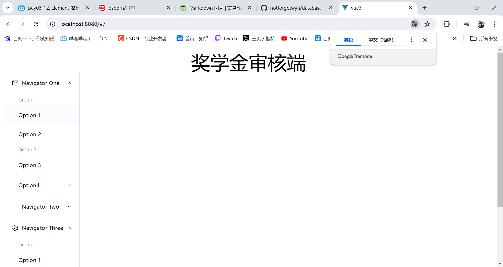

### 版本管理更新

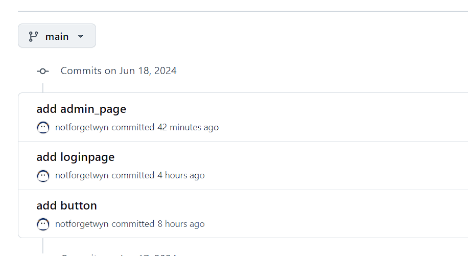

## 第二天

### 目标

安装 IDEA 和 Springboot 以及 Mybatis，通过以上完成一个简单后端示例。通过前端发送的信息接收到后端，后端经过数据库返回给签到完成前后端的交互

### 结果

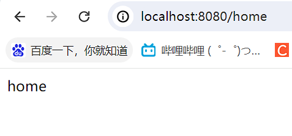
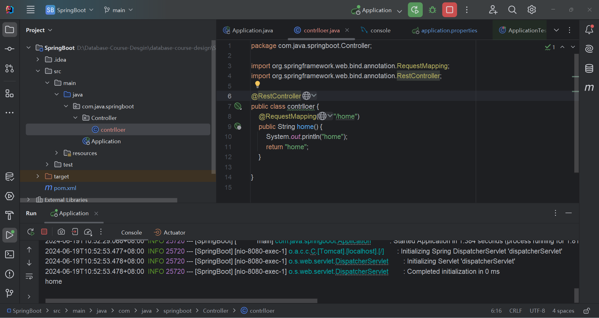
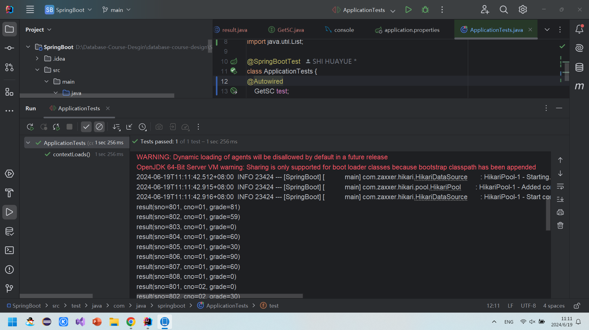

### 版本管理更新

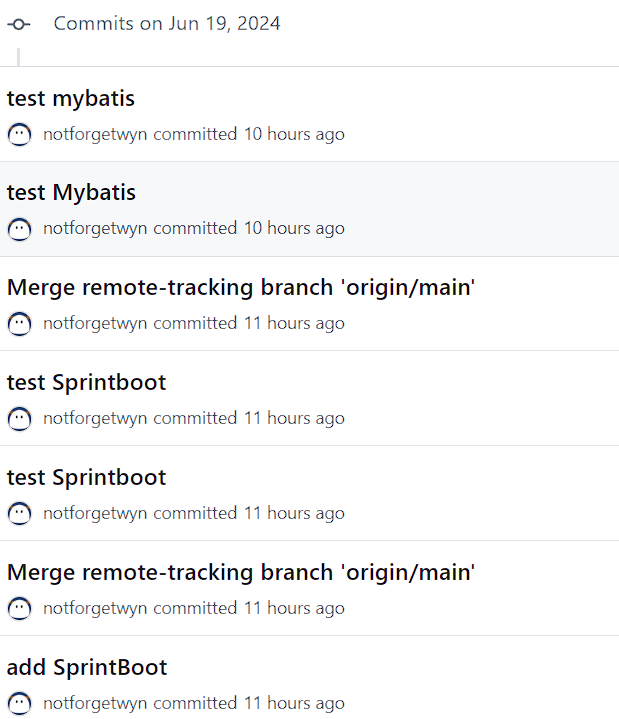

## 第三天

### 目标

通过阅读 elementplus 文档完成用户界面的基本设计

### 结果

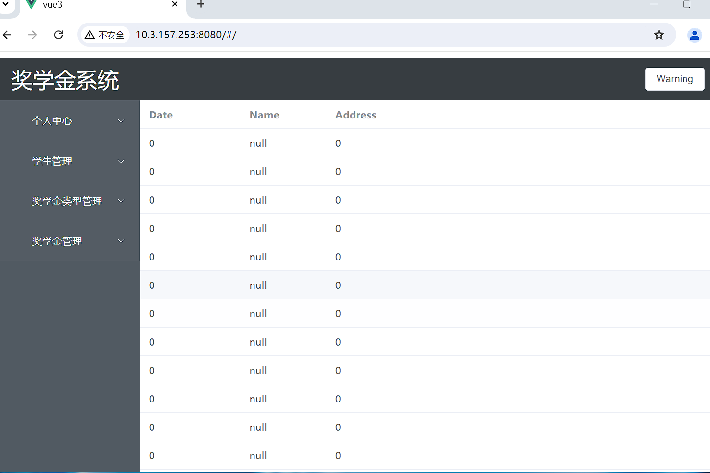

### 版本管理更新

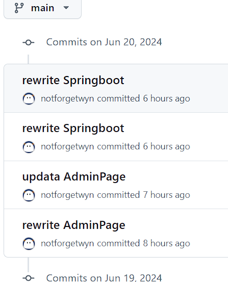

## 第四天

### 目标

完成前后端数据的交互

### 结果

### 版本管理更新

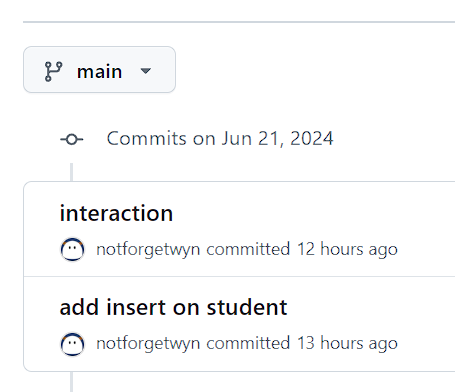

## 第五天

### 目标

更新了登录界面

### 结果

### 版本管理更新

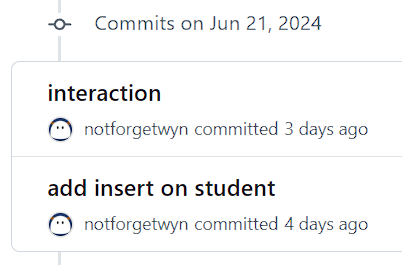

## 第六天

### 目标

通过路由完成页面跳转

### 结果

### 版本管理更新

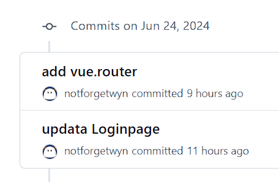
